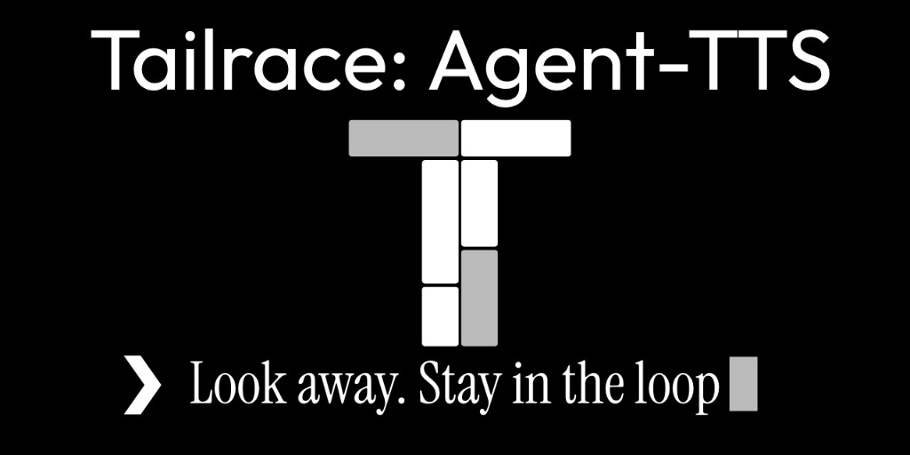

<p align="center">
  
</p>

# agent-tts

[](pyproject.toml)
[](pyproject.toml)
[](docs/multi-host.md)
[](hosts/cursor/README.md)
[](hosts/antigravity/README.md)
[](LICENSE)
[](https://github.com/TailraceHQ/agent-tts/actions/workflows/test.yml)
[](https://agent-tts.dev)

Speaks completed agent responses aloud. Opt-in, stdlib-only, shared config
under `~/.agent-tts/`.

Full docs (modes, playback, cloud voices): **[agent-tts.dev](https://agent-tts.dev)**.

## Compatibility

| | |
| --- | --- |
| Hosts | Claude Code, Cursor, Google Antigravity |
| OS | macOS (`say`), Windows (SAPI), Linux (`espeak-ng` or `spd-say`) |
| Python | 3.9+ |
| Voices | System default, or ElevenLabs / OpenAI / Azure |

## Install

Clone once. Speech starts **disabled** — run `on` after install.

**Claude Code**

```bash
git clone https://github.com/TailraceHQ/agent-tts.git ~/src/agent-tts
claude --plugin-dir ~/src/agent-tts
```

Then `/tts on`. To load it every time, add `--plugin-dir` to your `claude` wrapper.

**Cursor**

```bash
git clone https://github.com/TailraceHQ/agent-tts.git ~/src/agent-tts
~/src/agent-tts/hosts/cursor/install.sh
tts on
```

**Antigravity**

```bash
git clone https://github.com/TailraceHQ/agent-tts.git ~/src/agent-tts
agy plugin install ~/src/agent-tts
~/src/agent-tts/hosts/antigravity/run cli on
```

Direct CLI (no agent round-trip): `scripts/install-cli.sh` → `tts` on `PATH`.
Host-specific notes: [Cursor](hosts/cursor/README.md), [Antigravity](hosts/antigravity/README.md).

## Configuration

Defaults in `~/.agent-tts/config.json`. Prefer `/tts` or `tts` over editing the file.

```json
{
  "enabled": false,
  "mode": "summary",
  "prose_voice": null,
  "header_voice": null,
  "wpm": 175,
  "backend": "auto",
  "cloud": {
    "provider": "elevenlabs",
    "voice": null,
    "api_key": null,
    "region": null
  }
}
```

| Key | Meaning |
| --- | --- |
| `mode` | `summary` (first paragraph), `closing` (last), `brief` (first sentence), `full` |
| `backend` | `auto` (OS engine), or `macos` / `windows` / `linux` / `cloud` |
| `prose_voice` / `header_voice` | `null` = system default; header falls back to prose |
| `cloud` | Used only when `backend` is `cloud`. Prefer `ELEVENLABS_API_KEY`, `OPENAI_API_KEY`, or `AZURE_SPEECH_KEY` over storing `api_key` |

Override the data dir with `AGENT_TTS_DATA_DIR`. Legacy `~/.claude/claude-code-tts` is copied into `~/.agent-tts` on first use (`tts migrate`).

## Commands

`/tts` in chat and the `tts` binary share the same subcommands. Use the binary for `stop` / `skip` / `pause` — slash commands wait on the model.

| Command | Effect |
| --- | --- |
| `on` / `off` | Enable or disable automatic speech |
| `summary` / `closing` / `brief` / `full` | What to speak from each turn |
| `replay [mode]` | Replay the latest turn for this directory |
| `stop` / `skip` / `pause` / `resume` | Playback control |
| `preview` / `status` / `voices` | Inspect without changing much |
| `voice prose\|header <name>` | Select voices |
| `wpm <n>` | Speaking rate |
| `backend <auto\|macos\|windows\|linux\|cloud>` | Speech engine |
| `cloud <provider\|voice\|key\|region> <value>` | Cloud voice settings |
| `migrate` | Copy legacy Claude data dir into `~/.agent-tts` |

```text
tts voice prose Samantha
tts closing
tts preview
```

## More

- [Docs site (agent-tts.dev)](https://agent-tts.dev) - modes, skip/pause, cloud voices, how it works
- [Contributing](CONTRIBUTING.md)
- [License](LICENSE)
