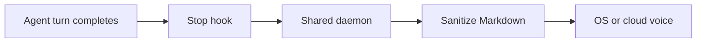

A Stop hook fires when the agent finishes. It does not read the transcript. It notifies a background daemon, which reads the final assistant message, sanitizes Markdown, and speaks.

The hook prints `{}` and returns. Cursor and Antigravity must not emit `followup_message` or `decision: continue`. TTS failures stay silent at the host boundary.

The daemon polls the transcript for up to three seconds if the final message has not landed yet. After 30 minutes with no work, the daemon exits and starts again on the next speak.

## Sanitizer

Before speech:

- Emphasis and link destinations are stripped
- Code blocks and tables become `see codeblock below` / `see table below`
- Identifiers and `file:line` references are expanded for speech
- Headings and blockquotes use the header voice
- List items are separate utterances

| Input | Spoken |
| --- | --- |
| `build()` | "the build function" |
| `load_config` | "the load config function" |
| `` `modes.py:12` `` | "mode dot pi, line 12" |
| fenced code | "see codeblock below" |

Mode then slices that queue. See [Choose what to speak](/docs/concepts/modes).

## Multiple sessions

Sessions that share `~/.agent-tts/` share one speaker.

- A newer **auto** reply from the same session replaces that session's queued auto job and interrupts it if it is already playing
- A reply from a different session waits
- Changing speakers announces `"<directory> speaking"`
- Enablement, mode, voices, and rate are global to the data directory

`auto` is the Stop-hook channel. `replay` is separate so `/tts replay` is not cancelled by that command's own Stop hook.

`tts stop` and `tts off` are global: they interrupt whoever is talking.

## See also

- [Control playback](/docs/guides/control-playback)
- [Command reference](/docs/reference/commands)
