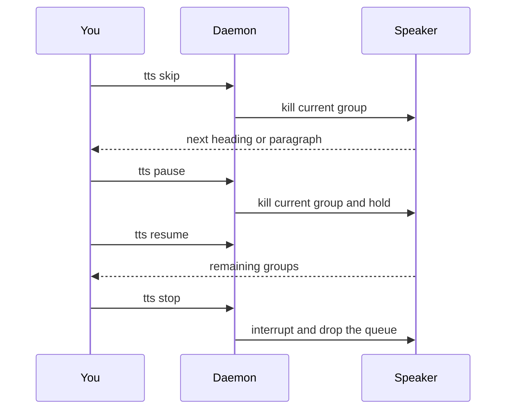

Slash `/tts stop` still works, but the agent has to choose a tool first. The `tts` binary sends the same request to the daemon in milliseconds.

```bash
scripts/install-cli.sh
tts stop
tts skip
tts pause
tts resume
```

## What each command does

You are listening to a **full** reply, where consecutive same-voice paragraphs form one utterance group. This sequence shows how skip, pause, resume, and stop act on that group:



| Command | While audio is playing | If nothing is playing |
| --- | --- | --- |
| `tts skip` | Cuts the current utterance group, continues this response | "Nothing to skip" |
| `tts pause` | Cuts the current utterance group and holds the rest | "Nothing to pause" |
| `tts resume` | Plays the next remaining group | "Nothing to resume" |
| `tts stop` | Interrupts playback and clears queued jobs | No-op |

<Callout type="info">
  Skip and pause cannot resume mid-sentence. The current `say` / cloud clip is terminated; resume starts at the next utterance group.
</Callout>

## Raycast

Create a Script Command per action:

```bash
#!/bin/bash
# @raycast.title TTS Skip
# @raycast.mode silent
"$HOME/.local/bin/tts" skip
```

Repeat for `stop`, `pause`, and `resume`.

## macOS Shortcuts

Add a **Run Shell Script** action with `$HOME/.local/bin/tts skip` and assign a keyboard shortcut in Shortcut details.

## Multiple sessions

Sessions that share `~/.agent-tts/` share one speaker. A newer auto reply from the **same** session replaces that session's queued auto job. A reply from a **different** session waits. Changing speakers announces `"<directory> speaking"`.

`tts stop` is global: it interrupts whoever is talking.

## See also

- [Choose what to speak](/docs/concepts/modes)
- [Command reference](/docs/reference/commands)
