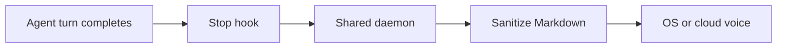

A Stop hook fires when the agent finishes. A local daemon reads the transcript, cleans the Markdown, and speaks it through your OS voice or a cloud provider. The hook itself stays fast and fail-open.



The hook never injects a follow-up into the chat. It prints `{}` and returns.

## What gets spoken

Pick a mode, then look at the same Cursor/Claude turn on the left and the audio on the right.

<SpeakPreview />

| Command | Speaks |
| --- | --- |
| `tts summary` | First prose paragraph (default) |
| `tts closing` | Last prose paragraph |
| `tts brief` | First sentence of the lead paragraph |
| `tts full` | Every cleaned block |

Headings and blockquotes use the **header** voice when you set one. Code blocks and tables become a short pointer (`see codeblock below`) instead of being read aloud. Turns that are only a pointer, or shorter than three words, stay silent.

See [Choose what to speak](/docs/concepts/modes) for junk skipping and dual-voice rules.

## Control without the model

Slash `/tts` still goes through the agent, so `stop` is slow. The `tts` binary talks to the daemon directly:

```bash
scripts/install-cli.sh   # ~/.local/bin/tts
tts stop
tts skip
tts pause
tts resume
```

Bind those to Raycast, a Shortcut, or any hotkey. See [Control playback](/docs/guides/control-playback).

## Next

<Cards>
  <Card title="Install" href="/docs/get-started/install">
    Claude Code, Cursor, or Antigravity in a few minutes.
  </Card>
  <Card title="Modes" href="/docs/concepts/modes">
    Why summary often says the wrong paragraph, and how closing fixes it.
  </Card>
  <Card title="Commands" href="/docs/reference/commands">
    Every `tts` subcommand.
  </Card>
  <Card title="How it works" href="/docs/concepts/how-it-works">
    Hook, daemon, sanitizer, and the session queue.
  </Card>
  <Card title="Troubleshooting" href="/docs/guides/troubleshooting">
    Silent playback and cloud HTTPS certificate errors.
  </Card>
</Cards>
